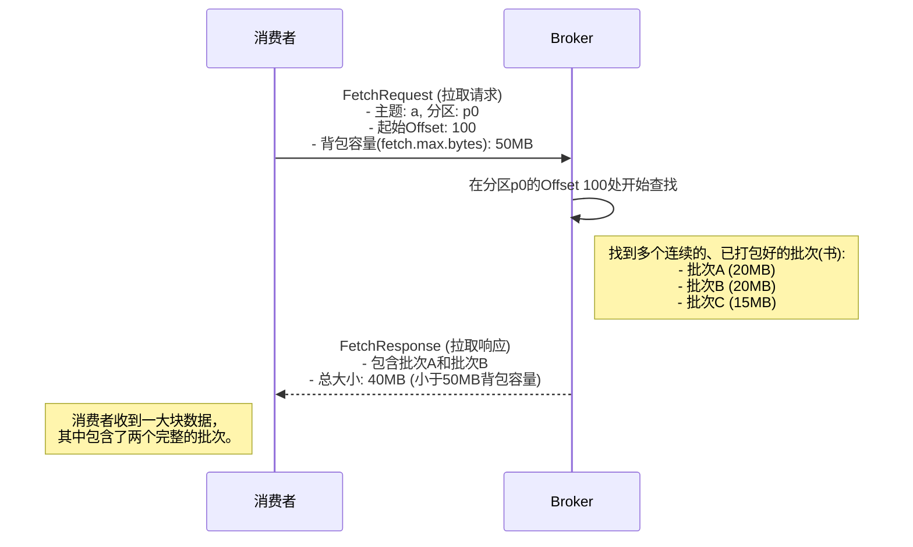

# 消费端的艺术：Kafka如何高效地"拉"数据

## 引言：图书馆的借书智慧

Kafka 的消费者（Consumer）从 Broker 获取数据的过程，并非简单的"你给一条，我拿一条"。为了追求极致的性能，这个过程更像是一场消费者与 Broker 之间的智能"协商"，我们可以用一个**"去图书馆借书"**的比喻来生动地理解它。

本文将深入剖析 Kafka 的数据拉取 (Pull) 模型，解释消费者是如何通过 `fetch.max.bytes` 等参数与 Broker 高效协作，一次性、批量地获取数据的。

## 核心概念：背包容量与装订成册的书

在我们的比喻中：

| 角色 | 对应关系 | 说明 |
|------|----------|------|
| 你（消费者）| Consumer | 去图书馆借书的读者 |
| `fetch.max.bytes` | 背包容量 | 最多只能装 50MB 的书 |
| 图书馆管理员 | Broker | 负责从书架上拿书给你的工作人员 |
| 书架上装订好的书 | Producer Batches | 生产者早已把消息打包成一本本装订好的书（批次），并存放在了 Broker 的书架（磁盘）上 |

## 拉取流程：一次性借走一摞书

消费者拉取数据的过程，并非一本一本地借，而是一次性借走一摞。

### 这个流程的关键点是：

1. **批量拉取**
   - Broker 不会把书一页一页（一条条消息）撕下来给你
   - 而是把一本一本装订好的"书"（生产者批次）给你

2. **凑满背包**
   - Broker 会尽可能多地把连续的"书"（批次）塞进你的背包
   - 只要总大小不超过 `fetch.max.bytes`
   - 这大大减少了网络往返次数，是提升消费吞吐量的关键

## 特殊情况：当第一本书就比背包大

如果 Broker 要发送的第一个批次的大小，就已经超过了消费者请求的 `fetch.max.bytes` 怎么办？

这是 Kafka 设计中的一个智能之处。此时，Broker 会忽略 `fetch.max.bytes` 的限制，依然将这个完整的、巨大的批次发送给消费者。

### 为什么这样设计？

1. **确保进度**
   - 为了保证消费者能够继续前进
   - 避免被一个巨大的消息批次永远阻塞住

2. **性能考量**
   - 遵循了 零拷贝 (Zero-Copy) 原则
   - Broker 可以直接从磁盘把这个压缩好的、完整的批次数据块直接发送到网卡
   - 中间不需要在 Broker 端进行任何解压和数据拆分
   - 性能极高

## 结语

Kafka 的消费端拉取模型，是一套精心设计的、兼顾了吞吐量和效率的机制。通过将数据打包成批次进行传输，并允许消费者定义其"背包容量"，Kafka 在客户端与服务器之间建立了一种高效的数据协商和传输模式。 