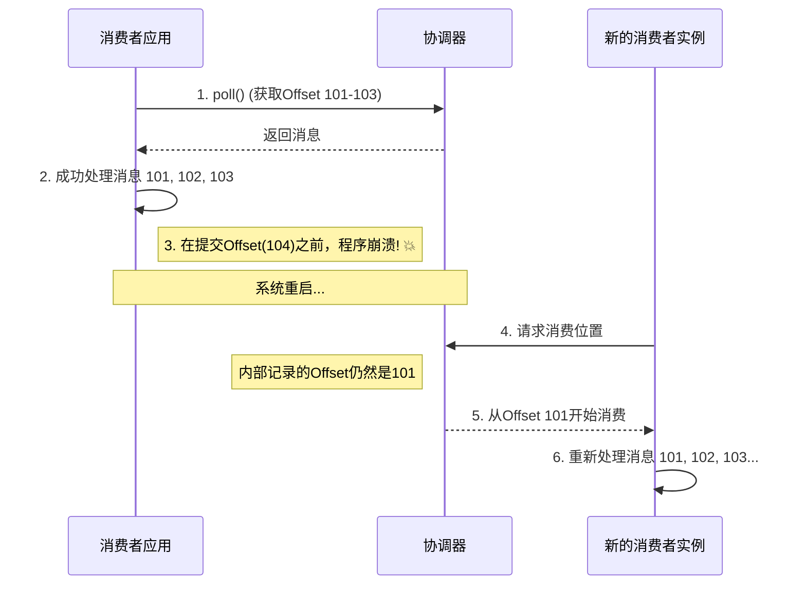
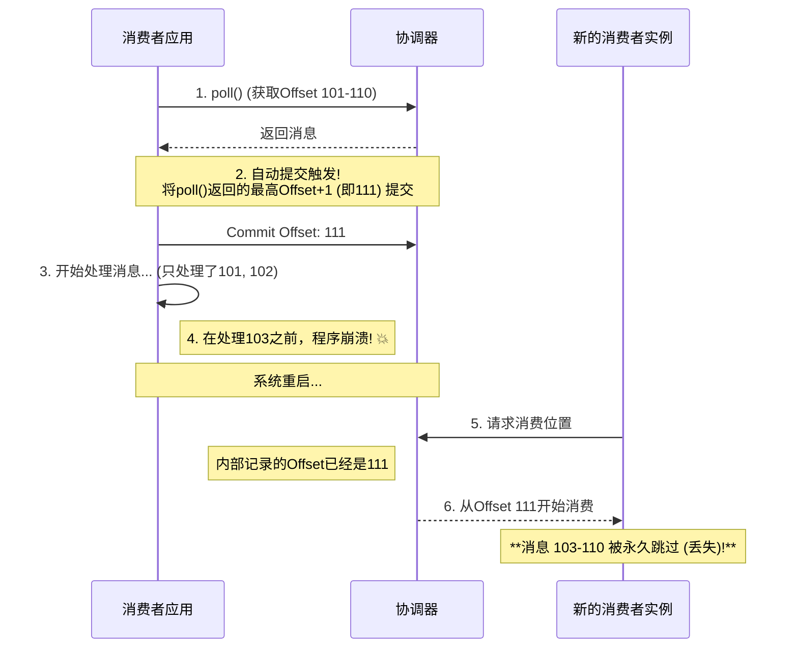

# Kafka Offset管理陷阱：重复消费与丢失消息全解析

## 引言：消费者可靠性的"双刃剑"

在 Kafka 的世界里，偏移量（Offset）是消费者用来记录消费进度的"书签"。如何以及何时移动这个书签，是保证数据处理可靠性的核心，也是一把稍有不慎就会割伤自己的"双刃剑"。

错误地管理 Offset，主要会导致两种截然相反的灾难性后果：重复消费和丢失消息。这分别对应了分布式系统中经典的**"至少一次" (At-Least-Once)** 和 **"至多一次" (At-Most-Once)** 两种处理语义。

本文将通过清晰的场景分析和时序图，为您彻底讲清楚这两种问题是如何因 Offset 提交时机不当而发生的。

## 核心原则：Broker的"盲目信任"

在深入场景之前，我们必须先牢记一个核心原则：Kafka 的群组协调器（Broker）就像一个极其信任员工的、盲目的"档案管理员"。它从不关心您是否真的处理了消息。它的工作原则是：

> "你（消费者）告诉我把书签放到第几页，我就放到第几页。我完全相信你的汇报。"

这个"盲目信任"的机制，正是产生所有问题的根源。

## 场景一：重复消费 (At-Least-Once)

这是最常见的情况，它发生在**"先处理，后提交"**的流程中。

### 发生过程

消费者采用先处理消息，再提交偏移量的策略。如果在处理完一批消息后，还没来得及提交 Offset，程序就崩溃了。

### "流水线工人"的比喻

1. **处理工作**: 流水线工人（消费者）成功地组装了零件 #101, #102, #103。
2. **汇报前崩溃**: 在他正准备拿起对讲机向经理（协调器）汇报"我做完103了"之前，工位突然断电（程序崩溃）。
3. **新人接替**: 新来的工人上岗后，询问经理进度。经理查看记录，发现官方进度还停留在之前的 #100。
4. **重复工作**: 新工人会从 #101 开始，把 #101, #102, #103 原封不动地重新组装一遍。

### 时序图解析

> **结论**：这种模式保证了消息至少会被处理一次，不会丢失，但代价是可能发生重复。在大多数需要保证数据完整性的场景下，这是一种可以接受并需要下游系统做好幂等处理的策略。

## 场景二：丢失消息 (At-Most-Once)

这是一种更危险、通常需要极力避免的情况。它发生在**"先提交，后处理"**的流程中，最典型的例子就是自动提交 Offset。

### 发生过程

消费者开启了自动提交（`enable.auto.commit=true`）。它拉取了一批消息，自动提交机制立刻就把这批消息中最高的 Offset 提交了。但随后，在消费者还没处理完这批消息时，程序就崩溃了。

### "不靠谱读者"的比喻

1. **借书与提前汇报**: 
   - 你（消费者）从图书馆 `poll()` 了一叠书页（Offset 101-110）
   - 你旁边的"自动汇报机"（自动提交）一看你拿了这批书，立刻就向系统汇报："他已经准备读到第111页了！"（提交了Offset 111）

2. **处理中崩溃**: 你刚开始读，只读完了第101、102页，你的电话突然响了，你立刻冲出了图书馆（程序崩溃）。

3. **回来继续**: 你重启程序后回到图书馆，询问你的阅读进度。

4. **跳过未读章节**: 系统忠实地告诉你："你的官方记录是已经读到了第111页。" 于是，你将从第111页开始继续借阅。

结果就是：第103页到第110页这些你根本没来得及看的内容，被永久地跳过了。

### 时序图解析

> **结论**：这种模式保证了消息最多只会被处理一次，但有丢失数据的风险。它只适用于那些可以容忍数据丢失，但绝对不能重复处理的特殊场景。

## 总结：可靠消费的黄金法则

| 错误行为 | 后果 | 对应的消费语义 |
|---------|------|---------------|
| 处理完消息后，提交Offset前崩溃 | 重复消费 | 至少一次 (At-Least-Once) |
| 处理消息前（或过程中），提前提交了更高的Offset，然后崩溃 | 丢失消息 | 至多一次 (At-Most-Once) |

### 最佳实践

为了实现真正的可靠消费（即"精确一次"语义，Exactly-Once），黄金法则是：

> 永远确保你的应用程序是在完全、成功地处理完一批消息之后，再去精确地提交这批消息中你实际处理到的那个位置的 Offset。

这就是为什么在所有对数据可靠性有严格要求的生产环境中，最佳实践几乎都是：**关闭自动提交，选择手动、精确地控制Offset的提交时机**。
