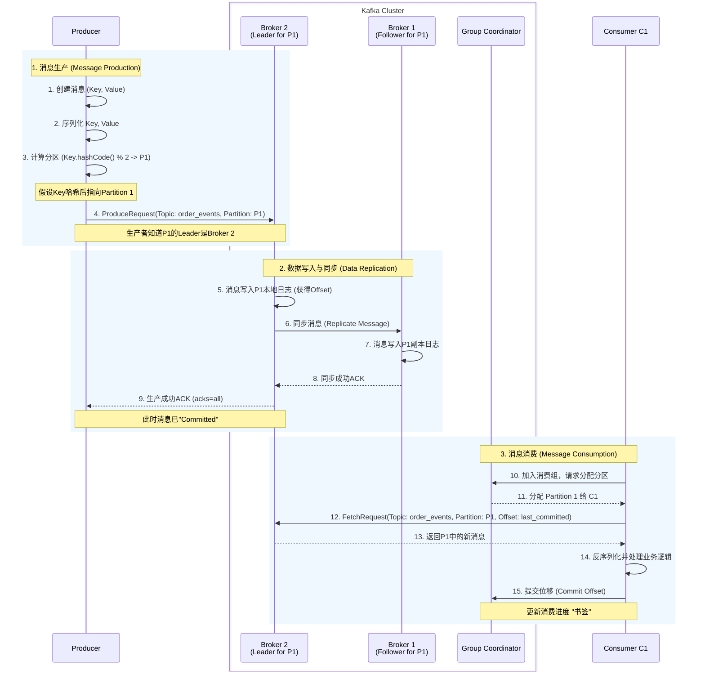
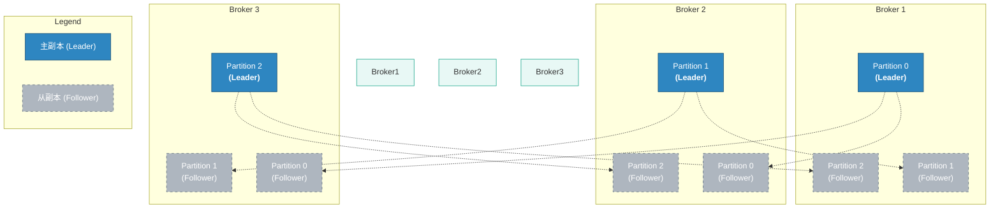

# Kafka 架构图

## 消息端到端生命周期

```mermaid
sequenceDiagram
    participant P as Producer
    box Kafka Cluster
    participant B2 as Broker 2<br/>(Leader for P1)
    participant B1 as Broker 1<br/>(Follower for P1)
    participant GC as Group Coordinator
    end
    participant C as Consumer C1

    %% 1. 消息生产
    rect rgb(240, 248, 255)
        Note over P: 1. 消息生产 (Message Production)
        P->>P: 1. 创建消息 (Key, Value)
        P->>P: 2. 序列化 Key, Value
        P->>P: 3. 计算分区 (Key.hashCode() % 2 -> P1)
        Note over P: 假设Key哈希后指向Partition 1
        P->>B2: 4. ProduceRequest(Topic: order_events, Partition: P1)
        Note over P,B2: 生产者知道P1的Leader是Broker 2
    end

    %% 2. 数据写入与同步
    rect rgb(240, 248, 255)
        Note over B2,B1: 2. 数据写入与同步 (Data Replication)
        B2->>B2: 5. 消息写入P1本地日志 (获得Offset)
        B2->>B1: 6. 同步消息 (Replicate Message)
        B1->>B1: 7. 消息写入P1副本日志
        B1-->>B2: 8. 同步成功ACK
        B2-->>P: 9. 生产成功ACK (acks=all)
        Note over B2,P: 此时消息已"Committed"
    end

    %% 3. 消息消费
    rect rgb(240, 248, 255)
        Note over C,GC: 3. 消息消费 (Message Consumption)
        C->>GC: 10. 加入消费组，请求分配分区
        GC-->>C: 11. 分配 Partition 1 给 C1
        C->>B2: 12. FetchRequest(Topic: order_events, Partition: P1, Offset: last_committed)
        B2-->>C: 13. 返回P1中的新消息
        C->>C: 14. 反序列化并处理业务逻辑
        C->>GC: 15. 提交位移 (Commit Offset)
        Note over C,GC: 更新消费进度 "书签"
    end
```

## 分区与副本分布示意图

```mermaid
flowchart TB
    subgraph Broker 1
        P0_B1["Partition 0<br/><b>(Leader)</b>"]:::leader
        P1_B1["Partition 1<br/>(Follower)"]:::follower
        P2_B1["Partition 2<br/>(Follower)"]:::follower
    end

    subgraph Broker 2
        P1_B2["Partition 1<br/><b>(Leader)</b>"]:::leader
        P0_B2["Partition 0<br/>(Follower)"]:::follower
        P2_B2["Partition 2<br/>(Follower)"]:::follower
    end

    subgraph Broker 3
        P2_B3["Partition 2<br/><b>(Leader)</b>"]:::leader
        P0_B3["Partition 0<br/>(Follower)"]:::follower
        P1_B3["Partition 1<br/>(Follower)"]:::follower
    end

    %% 同步关系
    P0_B1 -.-> P0_B2
    P0_B1 -.-> P0_B3
    P1_B2 -.-> P1_B1
    P1_B2 -.-> P1_B3
    P2_B3 -.-> P2_B1
    P2_B3 -.-> P2_B2

    %% 图例
    classDef leader fill:#2E86C1,stroke:#1B4F72,color:white
    classDef follower fill:#AEB6BF,stroke:#5D6D7E,color:white,stroke-dasharray: 5 5

    %% 添加说明
    style Broker1 fill:#E8F8F5,stroke:#17A589
    style Broker2 fill:#E8F8F5,stroke:#17A589
    style Broker3 fill:#E8F8F5,stroke:#17A589

    %% 图例说明
    subgraph Legend
        L1["主副本 (Leader)"]:::leader
        L2["从副本 (Follower)"]:::follower
    end
```

### 图例说明

- **主副本 (Leader)**：负责处理所有客户端的读写请求
- **从副本 (Follower)**：被动地从主副本同步数据，作为热备份。当主副本宕机时，会从中选举出新的主副本。
