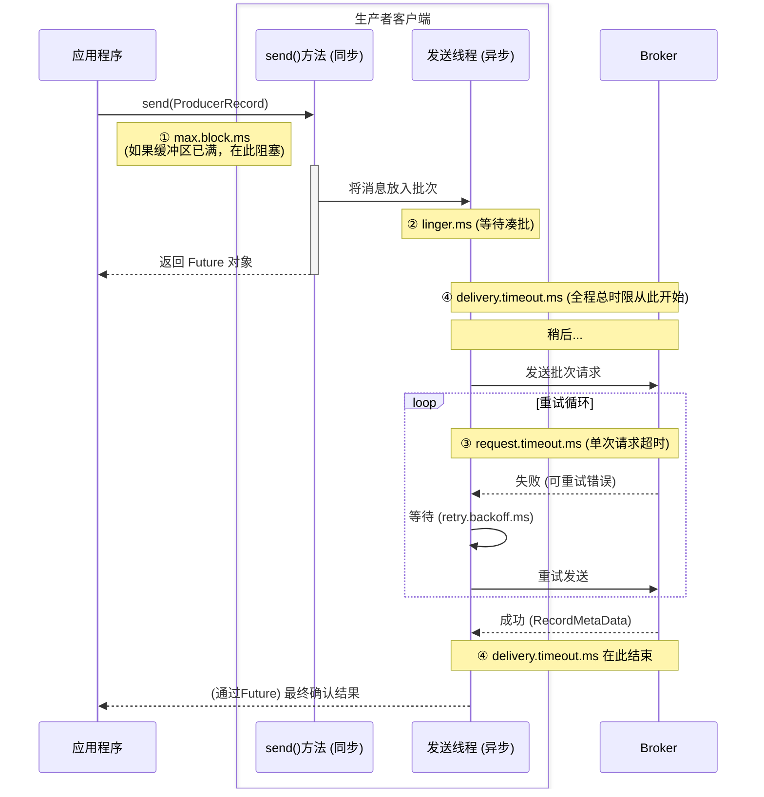

# Kafka生产者超时配置全解析：一次搞懂五个关键参数

## 引言：办公室的"寄件SOP"

要搞懂 Kafka 生产者的各种超时配置，最好的方法是把自己想象成一个办公室的行政人员，你的任务是把同事们的快递包裹高效、可靠地寄出去。

你的办公室里有一套完整的"寄件SOP"，而 Kafka 的这几个时间参数，就分别对应了这套SOP里不同环节的"等待时限"。

我们将用这个比喻，来解析以下五个核心参数：

- linger.ms
- request.timeout.ms
- delivery.timeout.ms
- max.block.ms
- retries & retry.backoff.ms

## 一张图看懂它们的"管辖范围"

在深入之前，我们先看一张图，它展示了从你调用send()方法到最终确认成功，各个超时参数作用的范围：

## 1. linger.ms：打包员的"凑单耐心"

### 它是什么？
打包员收到一个去往"北京"的包裹后，愿意在封箱前再等多久，看看还有没有其他去北京的包裹可以一起装箱。

### 它管哪一段？
从第一条消息进入批次，到这个批次被发送出去前的等待阶段。

### 一个故事帮你理解:

- **linger.ms = 0 (默认)**: 打包员是个急性子，收到一个包裹就想马上发车。但在高峰期，他手头事多，还是会不自觉地把几个包裹攒到一起再发。
- **linger.ms = 10**: 打包员是个精明人，他会明确地等待10毫秒。这个短暂的等待，极大地增加了"凑"成一个大包裹的可能性，大大提升了整体效率。

### 最佳实践与避坑指南:

这是提升吞吐量最常用的参数。在大多数场景下，设置 `linger.ms` 为 5-100毫秒 都是一个非常好的实践。它用几乎无感的延迟，换来了巨大的性能提升。

**坑**：不要认为 `linger.ms=0` 就意味着消息会立刻发送。在高负载下，批处理依然会发生。如果你要求极致的低延迟（不惜牺牲吞吐量），才需要考虑这个默认值。

## 2. request.timeout.ms：快递员的"等待回执耐心"

### 它是什么？
快递车把货送到目的地（Broker）后，司机愿意等待对方签收回执的最长时间。

### 它管哪一段？
一次独立的网络请求从发出，到收到Broker响应的这个过程。

### 一个故事帮你理解:
司机把车开到Broker的仓库门口，按了门铃，然后开始计时。如果在30秒内（默认值是30000ms）没人出来签收，司机就不会再等了，他会认为"这次投递失败"，然后把货拉回来，准备下一次再送（如果配置了重试）。

### 最佳实践与避坑指南:

- 通常不需要修改这个值。默认的30秒对于绝大多数网络环境都足够了。
- 如果你处在一个网络延迟极高的跨洲际网络环境中，可以适当调大这个值，比如60秒。
- **坑**：把它设置得太小，会导致在网络正常波动时，生产者就错误地认为请求超时，从而引发不必要的重试。

## 3. delivery.timeout.ms：你的"最终耐心底线"

### 它是什么？
从你把包裹交给收发室那一刻起，到你最终收到"已妥投"或"已退回"的最终通知，你愿意等待的总时长。

### 它管哪一段？
全程！它覆盖了消息在缓冲区等待、发送、可能的重试等所有环节。它是一个全局的、最终的截止日期。

### 一个故事帮你理解:
你告诉收发室："这个包裹，2分钟内 (`delivery.timeout.ms=120000`) 必须给我一个最终结果，不管是送到还是退回。超过2分钟，我就不要了，直接算它丢失！" 在这2分钟内，快递员可以尽情地去重试，但一旦2分钟的闹钟响了，所有努力都将终止。

### 最佳实践与避坑指南:

这是现代Kafka中配置可靠性的最佳方式！你应该优先使用它，而不是手动配置 `retries`。

**如何设置？**
评估一下你的Broker在发生故障（比如崩溃重启、首领选举）后，需要多长时间才能恢复服务。通常这个时间在几十秒左右。因此，将 `delivery.timeout.ms` 设置为一个略大于这个恢复时间的值，比如 2分钟，是一个非常合理的选择。

**原因**：这样配置能保证，即使在最坏的情况下（比如Broker正在进行首领选举），生产者也有足够的时间去成功重试，而不会过早地放弃。

## 4. max.block.ms：你在"前台排队的耐心"

### 它是什么？
当你抱着包裹去收发室，发现后台的货架（`buffer.memory`）已经堆满了，你愿意在前台站着排队等待多久。

### 它管哪一段？
只在调用 `send()` 方法，并且缓冲区已满时生效。

### 一个故事帮你理解:
你发现货架满了，前台不收件。`max.block.ms` 就是你愿意站在原地干等的最大时间。如果超过这个时间货架还没腾出空位，你就会不等了，直接把包裹拿走，并且大发雷霆（程序抛出异常）。

### 最佳实践与避坑指南:

- 这个参数控制的是你应用程序在发送端的阻塞行为。
- 大多数情况下，保持默认值（1分钟）即可。如果你不希望发送线程被长时间阻塞，可以适当调小它。

## 5. retries & retry.backoff.ms：快递员的"老派重试策略"

### 它们是什么？

- **retries**：快递员在第一次投递失败后，最多还愿意再尝试几次。
- **retry.backoff.ms**：每次重试前，愿意休息多久。

### 为什么不建议用？

1. **不够智能**：这个策略是"基于次数"的。如果网络一直不好，或者Broker恢复得慢，那么几次重试可能很快就用完了，最终导致发送失败。
2. **难以配置**：你需要精确估算"重试几次"和"每次等多久"才合适，这非常困难。

### 更好的替代方案：

正如前面所说，直接使用 `delivery.timeout.ms`。这是一个"基于时间"的策略，它告诉生产者："在最终截止日期前，你可以尽情地、智能地去重试"。这比机械地限制次数要灵活和可靠得多。

## 结语

掌握这些超时参数的关键，在于理解它们在消息发送旅程中各自的"管辖范围"。在现代 Kafka 实践中，我们的配置策略可以大大简化：

1. 设置一个合理的 `linger.ms` (比如 10ms) 来提升吞吐量。
2. 设置一个足够长的 `delivery.timeout.ms` (比如 2分钟) 来保证可靠性。
3. 其余的参数（`request.timeout.ms`, `max.block.ms` 等）在绝大多数情况下，保持默认值即可。

希望这篇"办公室寄件SOP"能帮您彻底理清这些配置，让您的 Kafka 生产者既高效又可靠！ 
