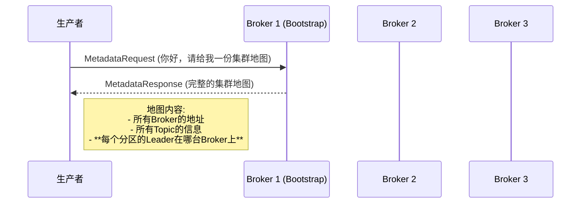
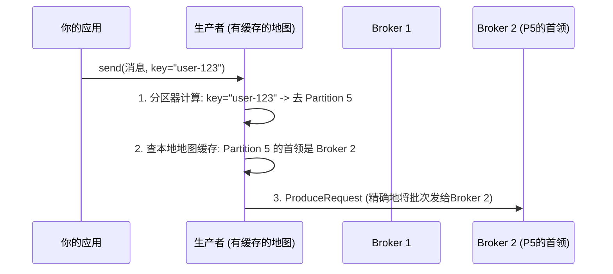
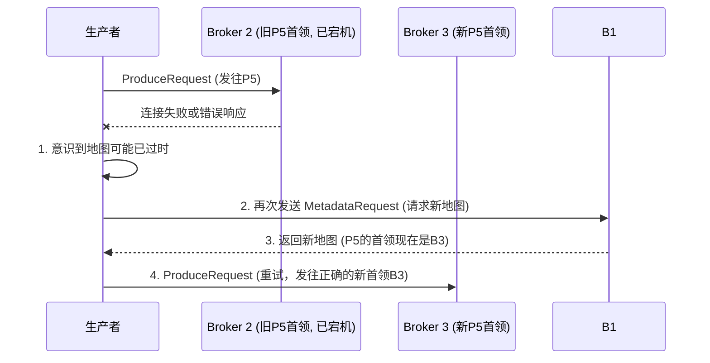

# 生产端的智慧：Kafka如何智能地"推"数据

## 引言：智能GPS导航系统

Kafka 的生产者（Producer）在发送消息时，并非盲目地将数据扔给集群中的任意一台服务器。它内部集成了一套如同拥有实时路况更新的智能GPS导航系统，能够精确、动态地找到正确的目标 Broker 并将数据推送过去。

本文将深入剖析 Kafka 的数据推送 (Push) 模型，解释生产者是如何通过"元数据"这张地图，实现客户端层面的负载均衡和高可用的。

## 核心机制：地图的获取与使用

生产者的智能导航主要依赖于元数据 (Metadata)。

### 第一步：问路 - 获取集群地图

当一个生产者第一次启动时，它对集群的内部结构一无所知。

1. 生产者会连接到你在 `bootstrap.servers` 中配置的任意一个"信息中心"（比如 Broker 1）
2. 它会发送一个元数据请求，索要整个集群的"地图"
3. Broker 返回的地图中，最关键的信息是：每一个分区的"首领 (Leader)"当前在哪一个 Broker 上
4. 生产者拿到这份地图后，会把它缓存在自己的内存里

### 第二步：精确导航 - 向首领发送数据

现在，生产者有了地图，它的发送行为就变得极其精确。

生产者遵循一个铁律：**永远只向分区的首领（Leader）发送数据**。因为它知道不同分区的首领被分布在不同的 Broker 上，所以它会根据每条消息的目的地（分区），智能地选择对应的 Broker 作为请求的目标，天然地实现了客户端层面的负载均衡。

## 自动纠错：当地图过时

如果一个 Broker 宕机，集群会选举出新的分区首领。此时，生产者脑中的地图就"过时"了。

当生产者向一个旧首领发送数据并失败时，这个失败会立刻触发它的"地图更新"机制：
1. 重新获取最新的元数据
2. 找到正确的新首领
3. 自动重试发送

## 结语

Kafka 生产者的智慧，在于它并非一个简单的"数据投掷器"。它是一个拥有自我感知和动态适应能力的智能客户端。通过缓存和按需刷新集群元数据，它能够：

- 主动地将数据流量导向正确的服务器
- 在集群发生变化时自动纠错
- 在客户端层面实现高效的负载均衡
- 提供强大的故障恢复能力 