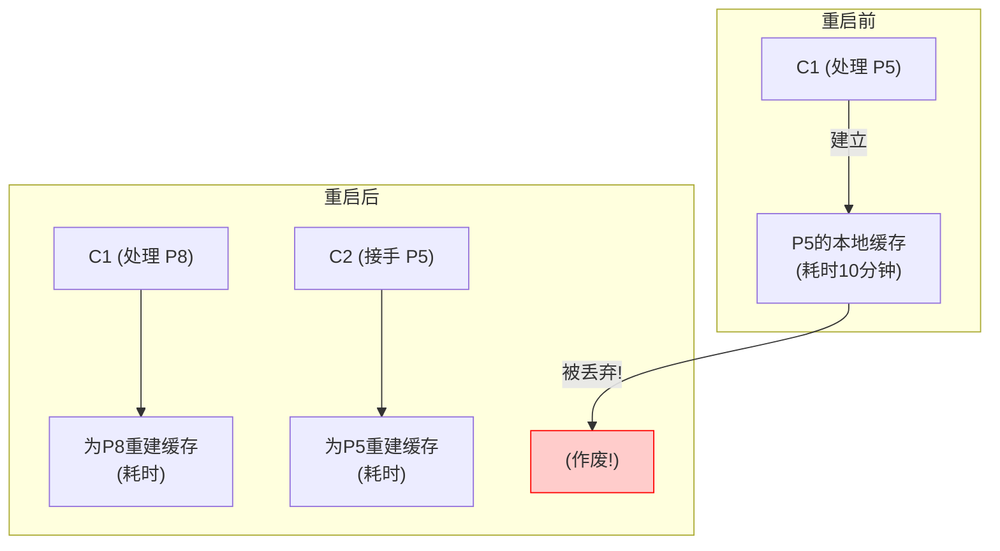

# Kafka有状态消费：固定成员与"专科医生"模式全解析

## 引言

在 Kafka 的消费世界里，大多数消费者就像是"急诊室医生"，他们可被随意替换，谁有空就处理哪个"病人"（分区）。但对于一些需要维护复杂本地状态的应用来说，这种模式的代价是高昂的。

本文将通过一个"专科医生 vs 急诊室医生"的比喻，深入剖析 Kafka 的群组固定成员 (Static Membership) 这个高级功能，解释它为什么是实现高效有状态消费 (Stateful Consumption) 的核心关键。

## 没有固定成员关系 (默认情况) = "急诊室医生"

### 工作模式
在急诊室里，医生们是可替换的。张医生下班了，李医生就来接替。他们不负责特定的病人，而是谁来了就看谁。

### 对应到 Kafka:
1. 一个消费者 C1 正在处理 分区5 的数据，并为此在本地建立了一个昂贵的缓存。
2. C1 因为部署更新而重启了。
3. 在它重启的瞬间，再均衡 (Rebalance) 发生了。协调器发现 C1 不在了，就把 分区5 这个"病人"立刻分配给了另一个空闲的医生 C2。
4. C1 重启回来后，再均衡再次发生，它可能被分配到了一个全新的任务——处理 分区8。

### 这会产生什么问题？

对于需要本地缓存的有状态应用来说，这种模式是灾难性的。一次简单的重启，就会导致：
- **缓存作废**：C1 为 P5 辛苦建立的本地缓存完全作废。
- **重复预热**：C1 需要为新的分区 P8 重新预热缓存，而接手 P5 的 C2 同样需要从零开始预热，导致双倍的资源浪费和性能下降。

## 固定成员关系 (group.instance.id) = "专科医生"

### 场景：需要维护昂贵的本地状态

想象一下，分区5 里是某个特定大客户（比如"阿里巴巴"）的所有交易数据。消费者 C1 是专门负责处理"阿里"业务的专科医生。

为了能快速处理"阿里"的新交易，C1 花了10分钟时间，把"阿里"过去一年的所有交易记录都从 Kafka 里读了一遍，然后在自己的内存里建立了一个非常复杂的客户画像缓存。这个缓存就是它的**"本地状态"**。

### 常见的"本地缓存"类型：

1. **实时聚合缓存**
   - 场景：计算商品页面的分钟级"独立访客数"
   - 实现：在内存中维护一个 Set 来存放本分钟内所有出现过的 userId
   - 特点：这个 Set 就是一个典型的本地状态

2. **外部数据关联缓存**
   - 场景：订单处理服务
   - 实现：预先将负责分区的用户信息加载到本地的 Map 中
   - 特点：用户信息 Map 是一个昂贵的本地缓存

### "专科医生"的工作模式

1. 给 C1 一个固定的身份（`group.instance.id`），标识："他是'阿里'的专属外科医生"
2. 当专科医生 C1 临时离开（程序重启，耗时30秒）时：
   - 医院管理系统（协调器）发现 C1 暂时联系不上了
   - 但不会立刻把 分区5 这个病人分配给别人
   - 30秒后，C1 回来了，重新连接上系统
   - 协调器识别出专属医生身份，立即恢复原有分配，不触发再均衡

### "专科医生"的秘密武器：本地状态持久化

#### 两个核心机制：
1. **群组固定成员关系**：保证医生回来后，还能负责原来的病人
2. **本地状态持久化**：将关键信息保存在本地磁盘

#### 工作流程：
- **下班前**（程序关闭时）：
  - 将内存中的缓存写入本地磁盘文件或嵌入式数据库（如RocksDB）
- **上班后**（程序重启时）：
  - 从本地磁盘加载"私人笔记"，快速恢复状态

#### 为什么选择本地状态而不是分布式缓存？
- **性能优势**：避免网络往返，实现微秒级访问延迟
- **数据局部性**：充分利用 Kafka 分区特性
- **备份恢复**：通过 Kafka Changelog Topic 机制保证，无需额外依赖

## 专科医生的"请假条"：理解 session.timeout.ms 的艺术

### 设置原则

#### 1. 设置得足够大（比如 3分钟）
- **目的**：容忍计划内的短暂重启
- **场景**：应用重启需要45秒，设置3分钟超时，避免再均衡
- **比喻**：专科医生请假5分钟，期间保留手术室和病人

#### 2. 设置得足够小（不能无限大）
- **目的**：及时发现真正的故障
- **风险**：过长的超时（如30分钟）会导致数据积压和业务延迟
- **比喻**：如果30分钟未返回，必须转交其他医生处理

## 总结

| 模式 | 重启时发生什么 | 本地缓存/状态 | 适用场景 |
|------|----------------|---------------|----------|
| 普通消费者 | 触发全局再均衡，分区可能重新分配 | 完全作废，需要重建 | 无状态消费（如简单日志ETL） |
| 固定成员 | 超时内不触发再均衡，保留分区 | 通过本地持久化保留，快速恢复 | 有状态消费（如流处理、本地缓存） |

### 核心思想
群组固定成员关系是为有状态消费者应用提供的优化机制。通过 **`group.instance.id` 锁定身份**，配合合适的 `session.timeout.ms`，在"容忍短暂重启"和"快速故障转移"之间取得平衡。 