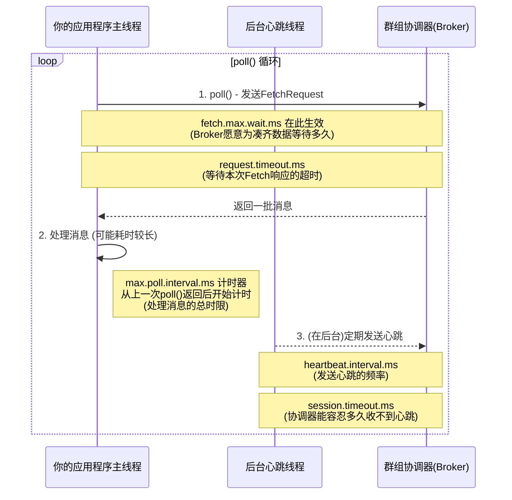

# Kafka消费者超时配置全解析：一次搞懂关键参数

## 引言：图书馆的"自助借书机"

要搞懂 Kafka 消费者的各种超时配置，最好的方法是把自己想象成一个正在图书馆自助借书机前操作的读者。你的目标是高效、可靠地借到你想要的书（消息）。

而 Kafka 的这几个时间参数，就分别对应了这台自助借书机以及整个图书馆系统，用来保证服务质量和检测异常的各种"倒计时"和"规则"。

## 一张图看懂它们的"管辖范围"

在深入之前，我们先看一张图。它描绘了一个消费者的完整工作循环，以及各个超时参数在其中扮演的角色：

## 两大"心跳"机制：Kafka如何知道你还"活着"？

这是判断消费者健康状况最重要的机制，它包含了两个层面的"心跳"检查。

### 1. session.timeout.ms & heartbeat.interval.ms：后台的"生命体征"

这两个参数必须放在一起理解，它们是群组协调器判断一个消费者是否连接存活的主要手段。

#### heartbeat.interval.ms (心跳间隔):
- **它是什么？** 这是消费者后台的一个"心跳线程"向协调器发送"我还活着"信号的频率。
- **比喻**: 保安（心跳线程）每隔3秒，就用对讲机向保安室（协调器）报告一次："一切正常！"

#### session.timeout.ms (会话超时):
- **它是什么？** 这是协调器能容忍一个消费者最久不报告的时间。默认是10秒（Kafka 2.x及之前）或45秒（Kafka 3.x及之后）。
- **比喻**: 如果保安室超过指定时间都没收到这个保安的报告，就会认为他"失联了"，并立刻派其他人去他的岗位（触发再均衡）。

#### 最佳实践与避坑指南:
- **黄金法则**: `heartbeat.interval.ms` 必须小于 `session.timeout.ms`，通常建议设置为后者的三分之一。
- **坑**: 把 `session.timeout.ms` 设置得过小，会让消费者在网络抖动或短暂GC时被错误地认为"已死亡"，导致频繁的、不必要的再均衡。设置得过大，则会导致真正的故障发现得太慢。

### 2. max.poll.interval.ms：主线程的"工作心跳"

这是另一个用来检测"活死人"消费者的关键参数，它解决了 `session.timeout.ms` 无法覆盖的一个盲区。

- **它是什么？** 它规定了你的应用程序在一次 `poll()` 调用之后，最多可以花多长时间来处理这批消息，然后必须再次调用 `poll()`。默认是5分钟。

- **为什么要它？** 想象一个场景：后台心跳线程还在正常报告"一切正常"，但你的主业务线程因为一个Bug卡死了（比如死循环）。从协调器的角度看，这个消费者还"活着"，但实际上它已经不再处理任何数据了。

- **比喻**: 保安还在用对讲机报告，但你这个借书人却抱着一本书在原地发呆了5分钟，一页也没翻。图书馆系统规定"你每次借书后，最多5分钟内必须回来借下一批，否则就认为你出了问题"。

#### 最佳实践与避坑指南:
- 如果你的消息处理逻辑非常耗时（比如需要调用慢API），你必须调大这个值，确保你的正常处理时间不会超过它。
- 如果你发现日志里频繁出现消费者"主动离开群组"的警告，很可能就是这个值设置得太小了。

## 两大"等待"时限：消费者的"耐心"

这组参数控制了消费者在拉取数据时的等待行为。

### 1. fetch.max.wait.ms：Broker的"凑数据耐心"

- **它是什么？** 当消费者请求数据，但Broker上暂时没有足够的数据时，Broker愿意为消费者等待多久，以期能凑齐更多数据再返回。
- **它与 fetch.min.bytes 的关系**: 这两个参数一起工作，哪个条件先满足，Broker就返回数据。
- **最佳实践**: 如果你追求低延迟，就调低这个值。如果你追求高吞吐量，就适当调高这个值，以减少网络请求次数。默认的500ms是一个很好的折中。

### 2. request.timeout.ms：客户端的"网络耐心"

- **它是什么？** 消费者发送一个请求（比如FetchRequest）后，愿意等待 Broker 响应的最长时间。默认30秒。
- **比喻**: 你在自助借书机上按下一个按钮后，愿意等待屏幕"转圈圈"的最长时间。

#### 最佳实践与避坑指南:
- 通常不需要修改这个值。默认的30秒对于绝大多数网络环境都足够了。
- **关键关系**: `request.timeout.ms` 的值必须大于 `fetch.max.wait.ms`。否则，你（消费者）的耐心还没有机器（Broker）的"凑书耐心"长，会导致在Broker正常工作的情况下，你就因为超时而放弃等待，引发大量不必要的重试。好在Kafka的默认配置已经保证了这一点。
- **坑**: 把它设置得太小会导致不必要的重试。

## 总结与现代配置策略

| 配置目标 | 关键参数 | 配置建议 |
|---------|----------|----------|
| 可用性 | `session.timeout.ms` & `heartbeat.interval.ms` | 遵循"1/3法则" |
| 防止"假死" | `max.poll.interval.ms` | 根据业务处理耗时调整 |
| 吞吐量/延迟 | `fetch.max.wait.ms` | 按需调整 |
| 网络稳定性 | `request.timeout.ms` | 保持默认值，确保大于`fetch.max.wait.ms` |

### 核心思想
群组固定成员关系是为有状态消费者应用提供的优化机制。通过合理配置这些超时参数，在"容忍短暂故障"和"快速故障转移"之间取得平衡。
