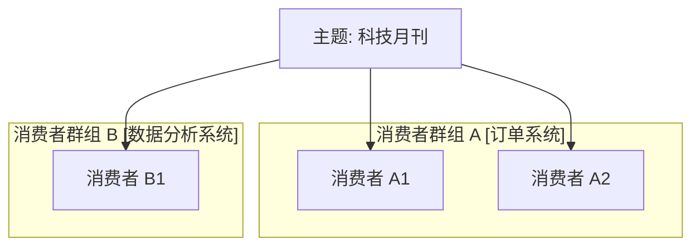

# Kafka 学习指南

欢迎来到 Kafka 学习指南！这是一个深入浅出的 Kafka 教程，旨在帮助开发者更好地理解和使用 Kafka。

## 内容概览

本教程涵盖以下主要内容：

- **Kafka 基础**：包括安装配置、基本概念等
- **生产者详解**：深入讲解生产者的配置和使用
- **消费者详解**：消费者模型、配置和最佳实践
- **存储机制**：深入理解 Kafka 的存储原理

## 特色

- 📚 系统化的知识结构
- 🔍 深入浅出的讲解
- 💻 丰富的代码示例
- 🛠 实用的最佳实践

## 快速开始

1. 从 [Kafka Broker安装验证指南](Kafka%20Broker安装验证指南.md) 开始
2. 按照 [kafka-cluster-setup.md](kafka-cluster-setup.md) 搭建集群
3. 根据需要选择相应的主题深入学习

## 贡献

欢迎通过 GitHub 提交 Issue 或 Pull Request 来帮助改进这个教程！ 
