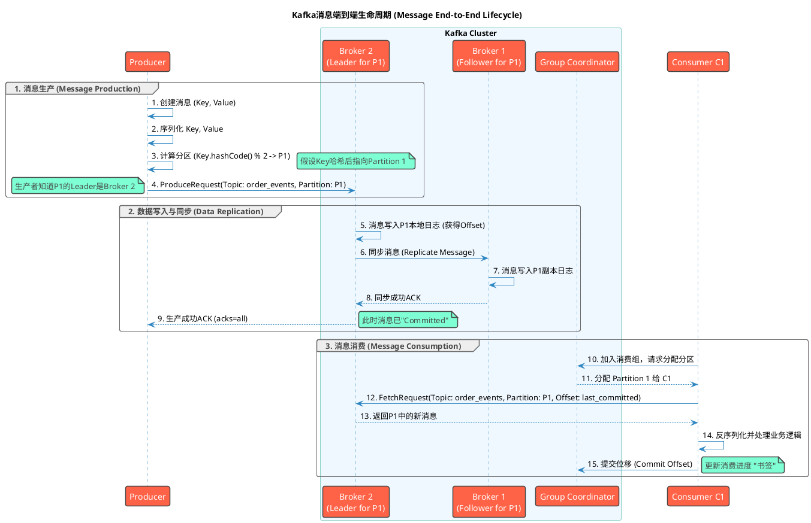
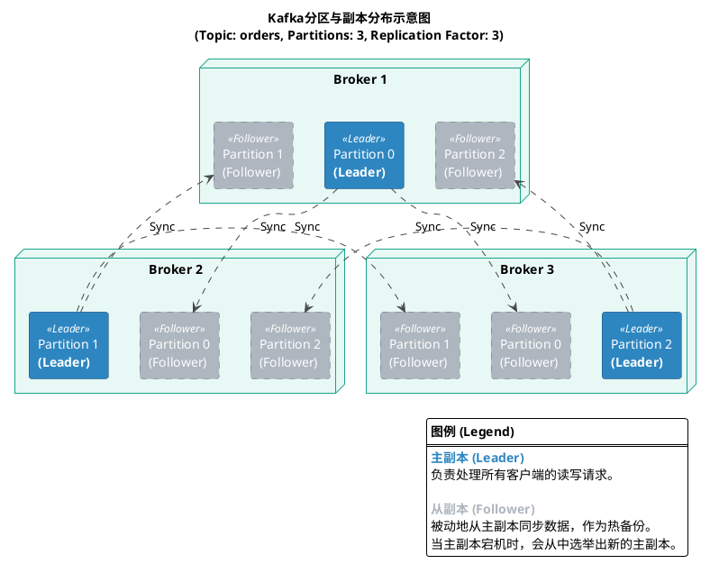

# Kafka 架构图

```plantuml
@startuml
!theme vibrant

title Kafka消息端到端生命周期 (Message End-to-End Lifecycle)

participant "Producer" as P
box "Kafka Cluster" #aliceblue
    participant "Broker 2\n(Leader for P1)" as B2
    participant "Broker 1\n(Follower for P1)" as B1
    participant "Group Coordinator" as GC
end box
participant "Consumer C1" as C

skinparam sequence {
    ArrowColor #2E86C1
    ActorBorderColor #2E86C1
    LifeLineBorderColor #2E86C1
    ParticipantBorderColor #17A589
    BoxBorderColor #17A589
    BoxBackgroundColor #E8F8F5
}

group 1. 消息生产 (Message Production)
    P -> P: 1. 创建消息 (Key, Value)
    P -> P: 2. 序列化 Key, Value
    P -> P: 3. 计算分区 (Key.hashCode() % 2 -> P1)
    note right: 假设Key哈希后指向Partition 1
    P -> B2: 4. ProduceRequest(Topic: order_events, Partition: P1)
    note left: 生产者知道P1的Leader是Broker 2
end

group 2. 数据写入与同步 (Data Replication)
    B2 -> B2: 5. 消息写入P1本地日志 (获得Offset)
    B2 -> B1: 6. 同步消息 (Replicate Message)
    B1 -> B1: 7. 消息写入P1副本日志
    B1 --> B2: 8. 同步成功ACK
    B2 --> P: 9. 生产成功ACK (acks=all)
    note right: 此时消息已"Committed"
end

group 3. 消息消费 (Message Consumption)
    C -> GC: 10. 加入消费组，请求分配分区
    GC --> C: 11. 分配 Partition 1 给 C1
    C -> B2: 12. FetchRequest(Topic: order_events, Partition: P1, Offset: last_committed)
    B2 --> C: 13. 返回P1中的新消息
    C -> C: 14. 反序列化并处理业务逻辑
    C -> GC: 15. 提交位移 (Commit Offset)
    note right: 更新消费进度 "书签"
end

@enduml

```

```plantuml
@startuml
!theme vibrant

title Kafka分区与副本分布示意图\n(Topic: orders, Partitions: 3, Replication Factor: 3)

' --- 定义样式 ---
skinparam rectangle {
    StereotypeFontColor #FFFFFF
    StereotypeFontSize 12
}
skinparam node {
    borderColor #17A589
    backgroundColor #E8F8F5
    fontColor #000000
    fontSize 14
}
' Leader副本的样式
skinparam rectangle<<Leader>> {
    backgroundColor #2E86C1
    borderColor #1B4F72
    fontColor #FFFFFF
}
' Follower副本的样式
skinparam rectangle<<Follower>> {
    backgroundColor #AEB6BF
    borderColor #5D6D7E
    fontColor #FFFFFF
    borderStyle dashed
}

' --- 定义Broker节点 ---
node "Broker 1" as B1 {
    rectangle "Partition 0\n<b>(Leader)</b>" <<Leader>> as P0_B1
    rectangle "Partition 1\n(Follower)" <<Follower>> as P1_B1
    rectangle "Partition 2\n(Follower)" <<Follower>> as P2_B1
}

node "Broker 2" as B2 {
    rectangle "Partition 1\n<b>(Leader)</b>" <<Leader>> as P1_B2
    rectangle "Partition 0\n(Follower)" <<Follower>> as P0_B2
    rectangle "Partition 2\n(Follower)" <<Follower>> as P2_B2
}

node "Broker 3" as B3 {
    rectangle "Partition 2\n<b>(Leader)</b>" <<Leader>> as P2_B3
    rectangle "Partition 0\n(Follower)" <<Follower>> as P0_B3
    rectangle "Partition 1\n(Follower)" <<Follower>> as P1_B3
}

' --- 定义图例 ---
legend right
  <b>图例 (Legend)</b>
  ====
  <font color=#2E86C1><b>主副本 (Leader)</b></font>
  负责处理所有客户端的读写请求。

  <font color=#AEB6BF><b>从副本 (Follower)</b></font>
  被动地从主副本同步数据，作为热备份。
  当主副本宕机时，会从中选举出新的主副本。
endlegend

' --- 定义同步关系 ---
P0_B1 ..> P0_B2 : Sync
P0_B1 ..> P0_B3 : Sync

P1_B2 ..> P1_B1 : Sync
P1_B2 ..> P1_B3 : Sync

P2_B3 ..> P2_B1 : Sync
P2_B3 ..> P2_B2 : Sync

@enduml

```
